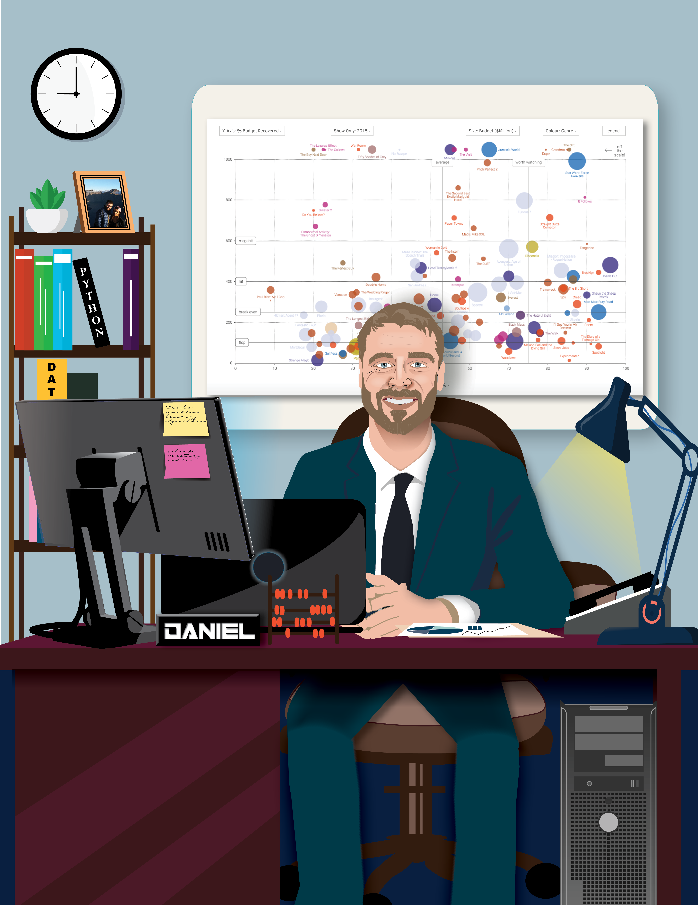

# Who I am
I am a **Data Scientist** who loves programming and has a strong interest in data visualization and machine learning.
## Education
🎓 MSc in Data Science from Birkbeck, University of London

🎓 BSc in Mathematics from West Virginia University

## I specialize in
- Python
- R
- SQL

## My favorite Python Libraries
<pre>
◾ Scikit-Learn    ◾ Keras   ◾ TensorFlow  ◾ Pandas     ◾ Matplotlib
◾ Plotly          ◾ Dash    ◾ Seaborn     ◾ GeoPandas  ◾ SciPy
◾ NumPy           ◾ OpenCV
</pre>
# About me
I was first introduced into programming during secondary education where I learned basic **C++**. Later in university I became familiar with basic **JavaScript** and **Matlab**. Primarily my background is in mathematical and statistical analysis, obtaining my BSc in Mathematics from West Virginia University. While in University I was able to help as a research assistant in a flow cytometry lab where I first experienced big data analytics using **Microsoft Excel**.

After University I spent over 5 years teaching primary and secondary education in the United States and in Thailand. During that period I taught myself basic **R** and **Python** programming skills. I improved upon my skills by taking various courses online related to Data Science through Coursera and DataCamp.

Eventually I decided to pursue my MSc in Data Science and started attending Birkbeck, University of London where I graduated in September 2020. My focus has been on **Python**, **SQL**, **R**, **Java**, **neural networks**, **dimensionality reduction**, **network theory**, **optimization techniques**, **data visualization** and **cloud computing**. My side projects tend to utilize various libraries for data manipulation, model building and visualization. My MSc project was focused on LSTM neural networks trained on financial data and optimization through the use of evolutionary algorithms.

I love to travel all over the world 🌍. I've visited Canada, Thailand, India, Palestine, Israel, France, Italy, Vietnam, Singapore, Indonesia, Turkey, Costa Rica, and England. Coming from the mountain state of West Virginia where I was raised, I've lived in Virginia, and later moved to Thailand to teach mathematics and science to bilingual students. I now live in London, England with my wonderful wife where we are have furthered our educational journey.

Besides programming and traveling I have always enjoyed investing, video games, weightlifting, exercise, sports, muay thai, boxing, mixed martial arts, science fiction, fantasy, cooking, and reading. If you share any of these interests or ever need help working with data, please feel free to contact me!

I'm open to work on various data and programming related projects so please feel free to contact me!

## Current Work
- I am helping my mentor and old boss develop a dashboard for tracking the spread of Covid-19 in the state of Pennsylvania. I have used dash to design the website, plotly for interactive visuals and deployed it using Heroku cloud service. The website can be found here: https://penn-covid-19.herokuapp.com/

- Working on a NLP project utilizing the Twitter API. More to come on this!

## Contact me or check out some of my work

💻 My portfolio website: https://danielbsimpson.github.io/

📊 My Kaggle notebooks: https://www.kaggle.com/dbsimpson/notebooks

:bowtie: Visit my LinkedIn page and connect with me: https://www.linkedin.com/in/daniel-b-simpson/

📫 How to reach me: simpson.danielb@gmail.com
